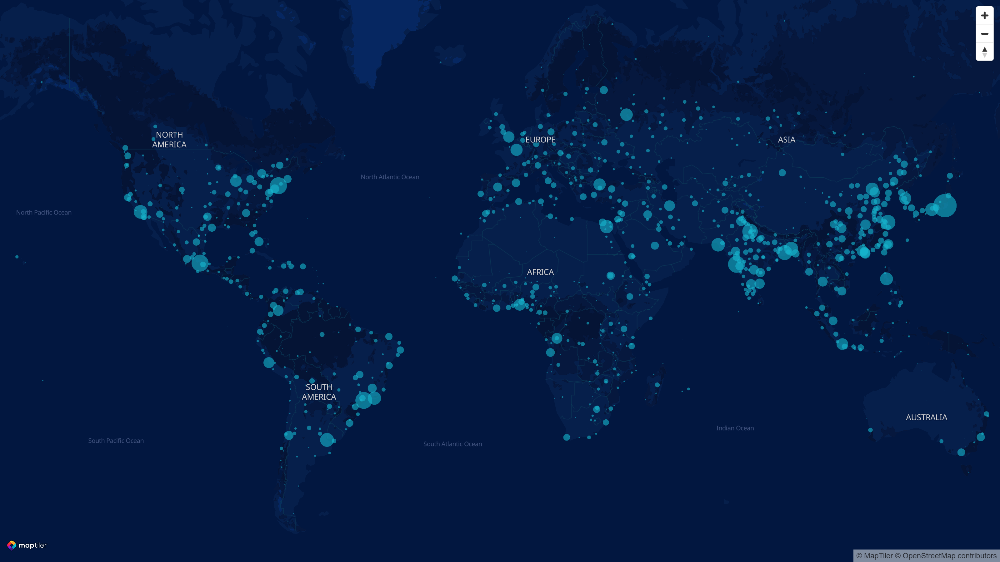

# 30DayMapChallenge
All of my maps for #30DayMapChallenge 2022.
## Day 1: Points
My very first submission to the #30DayMapChallenge ever. This one was done using the Advanced Editor in MapTiler Cloud. Data on the cities population come from Natural Earth. 
I used this expression for the circle radius in the JSON code:
```
"circle-radius": 
    [
      "sqrt",
      ["/", ["get", "POP_MAX"], 100000]
    ]
```

