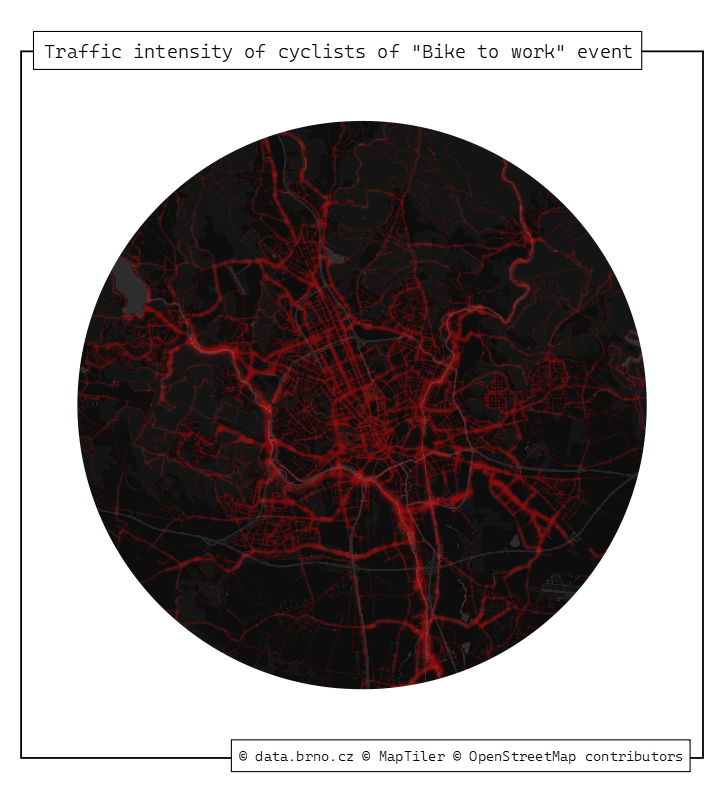
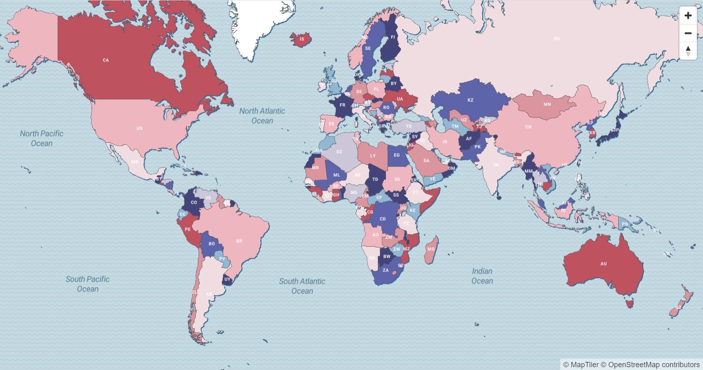
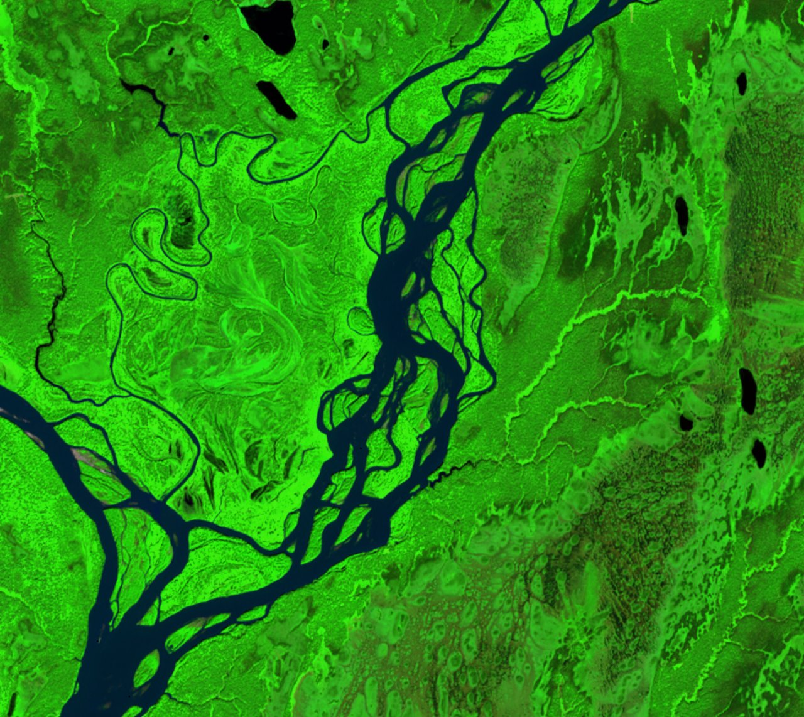

# 30DayMapChallenge
All of my maps for #30DayMapChallenge 2022. Kudos to Topi Tjukanov for running this awesome mappy event. See more info here: https://github.com/tjukanovt/30DayMapChallenge.
## Day 1: Points
My very first submission to the #30DayMapChallenge ever. This one was done using the Advanced Editor in MapTiler Cloud. Data on the cities population come from Natural Earth and were tiled with MapTiler Desktop. You can also upload a GeoJSON directly withou tiling it.
I used this expression for the circle radius in the JSON code:
```
"circle-radius": 
    [
      "sqrt",
      ["/", ["get", "POP_MAX"], 100000]
    ]
```

## Day 2: Lines
When thinking of lines, the biking routes in Brno, Czechia (where I partly live now) came to my mind immediately. You can find the open data for the "Bike to work" event [here] (https://data.brno.cz/datasets/mestobrno::dopravn%C3%AD-intenzity-cyklist%C5%AF-do-pr%C3%A1ce-na-kole-traffic-intensity-of-cyclists-of-bike-to-work-event/explore?location=49.164481%2C16.640643%2C9.62) in a variety of formats. The Carto Dark Matter basemap was pulled to QGIS by the [MapTiler plugin] (https://plugins.qgis.org/plugins/qgis-maptiler-plugin/).

## Day 3: Polygons
This submission was inspired by the landing map on the [MapLibre project] (https://maplibre.org/), I just tweaked the colours. The code for the color styling is available here: https://github.com/maplibre/demotiles/blob/gh-pages/style.json.

## Day 4: Green
I decided to do all color Fridays with remote sensing data as it used to be my favourite subject at uni. The green one is the confluence of the Alaskan rivers Susitna and Yentna. Processed with [Sentinel Hub] (https://www.sentinel-hub.com/) in SWIR, where the green stands out nicely.

