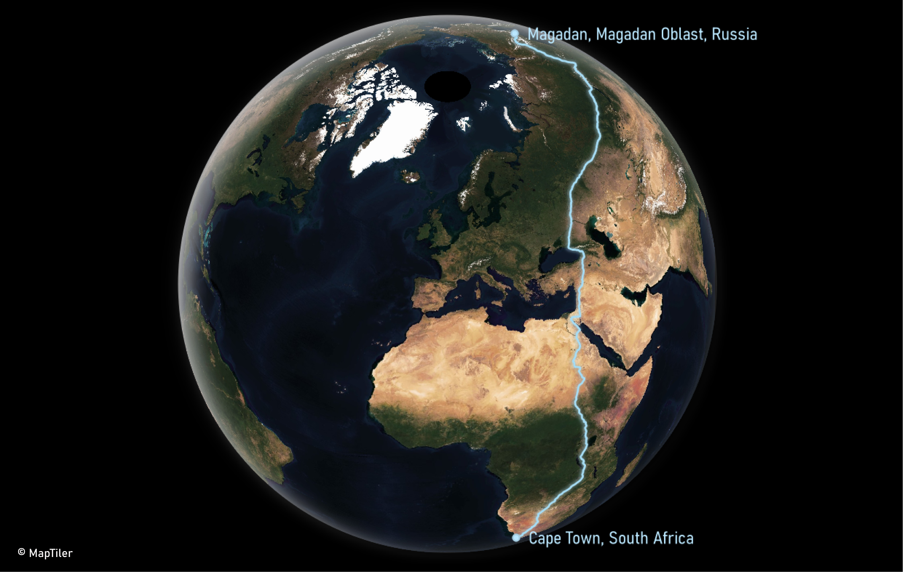
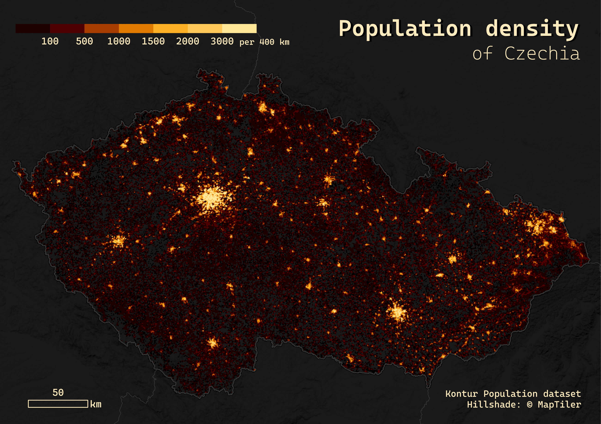
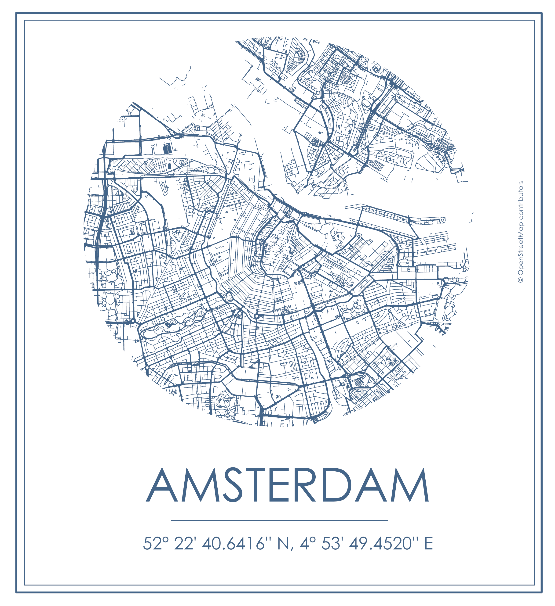

# 30DayMapChallenge
All of my maps for #30DayMapChallenge 2022. Kudos to Topi Tjukanov for running this awesome mappy event. See more info here: https://github.com/tjukanovt/30DayMapChallenge.
## Day 1: Points
My very first submission to the #30DayMapChallenge ever. This one was done using the Advanced Editor in [MapTiler Cloud](https://www.maptiler.com/cloud/). Data on the cities population come from [Natural Earth](https://www.naturalearthdata.com/) and were tiled with MapTiler Desktop. You can also upload a GeoJSON directly withou tiling it.
I used this expression for the circle radius in the JSON code:
```
"circle-radius": 
    [
      "sqrt",
      ["/", ["get", "POP_MAX"], 100000]
    ]
```

## Day 2: Lines
When thinking of lines, the biking routes in Brno, Czechia (where I partly live now) came to my mind immediately. You can find the open data for the "Bike to work" event [here](https://data.brno.cz/datasets/mestobrno::dopravn%C3%AD-intenzity-cyklist%C5%AF-do-pr%C3%A1ce-na-kole-traffic-intensity-of-cyclists-of-bike-to-work-event/explore?location=49.164481%2C16.640643%2C9.62) in a variety of formats. There are even more awesome datasets at https://datahub.brno.cz/. The Carto inspired Dark Matter basemap was pulled to QGIS by the [MapTiler plugin](https://plugins.qgis.org/plugins/qgis-maptiler-plugin/).


## Day 3: Polygons
This submission was inspired by the map on the landing page of [MapLibre project](https://maplibre.org/), I just tweaked the colours. The code for the color styling is available here: https://github.com/maplibre/demotiles/blob/gh-pages/style.json.


## Day 4: Green
I decided to do all color Fridays with remote sensing data as it used to be my favourite subject at uni (that I finished this year, yay!). The green one is the confluence of the Alaskan rivers Susitna and Yentna. Processed with [Sentinel Hub](https://www.sentinel-hub.com/) in SWIR, where the green stands out nicely.


## Day 5: Ukraine
For this submission I didn't have enough time so I created a yellow-blue variant of the Toner style in [MapTiler Cloud](https://www.maptiler.com/cloud/), then cut it in the Inkscape by the dove shape from Freepik.


## Day 6: Network
I found this cool dataset about the Roman Road Network from DARMC: https://dataverse.harvard.edu/dataset.xhtml?persistentId=doi:10.7910/DVN/TI0KAU and went to try an old map style in QGIS. Didn't turn out quite as I anticipated, but lesson learned!

 
## Day 7: Raster
I wanted to explore the David Rumsey's Map Collection and found [this](https://www.davidrumsey.com/luna/servlet/detail/RUMSEY~8~1~345354~90112811:Jizni-Pol%25C3%25A1rn%25C3%25AD-Kraje-%3D-Southern-Pola?sort=Pub_List_No_InitialSort%2CPub_Date%2CPub_List_No%2CSeries_No&qvq=q:czechoslovak%20academy%20of%20science;sort:Pub_List_No_InitialSort%2CPub_Date%2CPub_List_No%2CSeries_No;lc:RUMSEY~8~1&mi=7&trs=301) awesome map from 1965 by the Czechoslovak Academy of Science. Then I georeferenced and overlayed it with the #REMA contours from Living Atlas in ArcGIS Pro. 

 
## Day 8: OpenStreetMap
I work with OSM data on regular basis, be it work, school, or personal projects. The maps I love the most with OSM are these kind of minimalist road networks. I downloaded all the cities from https://download.geofabrik.de/, they are available as extracts so you don't have to download the whole country. Layouts were made in ArcGIS Pro.

 
## Day 9: Space
Space = Star Wars! This one was created with Natural Earth world countries (be careful to select the worldview with Ukraine mapped correctly, such as the US) in QGIS using some blending options between the layers and background. Filming locations can be found on the wiki: https://en.wikipedia.org/wiki/List_of_Star_Wars_filming_locations. Background space image is from Francesco Ungaro: https://www.pexels.com/photo/starry-sky-998641/. Also, I used this [Star Jedi](https://fontmeme.com/fonts/star-jedi-font/) font for the title, cool stuff.


## Day 10: A bad map
No description needed.


## Day 11: Red
Once again I used the [Sentinel Hub](https://www.sentinel-hub.com/) and looked for beautiful rivers in Alaska in NIR. The contrast of snow-covered and regular Nushagak River surroundings is quite a look.

 
## Day 12: Scale
Have you ever seen how Greeland actually looks compared to Africa? I bet you did, but how about Canada and South America? I was as surprised as you might be! This map was created in ArcGIS Pro, using Natural Earth data and local projections from https://epsg.io/.


## Day 13: 5 minute map
Created with the default Toner style from [MapTiler Cloud](https://www.maptiler.com/cloud/). 


## Day 14: Hexagons & Day 15: Food/drink
By this day, I started to feel the time pressure as I haven't prepared any of the maps in advance. Hence, I combined these two days together and created hexagons/drink map with cafés in Prague. The cafés are from OSM, downloaded with [QuickOSM plugin](https://plugins.qgis.org/plugins/QuickOSM/). The image of coffee cup 


## Day 16: Minimal
OSM rivers in Czech Republic styled by their hierarchy.


## Day 17: Map without a computer
For this one, I went to visit my geoinformatics department at uni and borrowed a military map which is typically used for the first class assignment for first-year students. Back then, I wanted to burn the map so badly. Now I must admit I really enjoyed the drawing of contours!

 
## Day 18: Blue
This day I really wanted to show the awesome colors on the [MapTiler satellite](https://www.maptiler.com/maps/#style=hybrid&mode=2d&position=8.25/24.535/-77.497). Many differents shades of blue in the ocean near Bahamas.


## Day 19: Globe
My first time trying the [Globe Builder](https://plugins.qgis.org/plugins/GlobeBuilder/) plugin in QGIS (why haven't I tried it earlier?!). And since the default Sentinel imagery doesn't look so good for the world view, I used the MapTiler Satellite map as a replacement. Also, recently I saw some posts about the longest route one can walk by foot accross the world and this was the right opportunity to map it. I exported the GPX route from Google Maps to QGIS and styled it.



## Day 20: My favourite...
...city is London. I used the #prettymap project for this visualization. Available either on GitHub: https://github.com/chrieke/prettymapp or through [Streamlit](https://mikael-codes-prettymapp-streamlit-prettymappapp-ccs1so.streamlit.app/).


## Day 21: Kontur population dataset
This map was made completely in ArcGIS Pro, the MapTiler hillshade is added as a WMTS. It helped me a lot that you can download Kontur population data by country here: https://data.humdata.org/organization/kontur instead of downloading the whole world. The color palette that I slightly adjusted is from Kenneth Field and can be found [here](https://esri-styles.maps.arcgis.com/home/item.html?id=ff2595989f164776ac6d3794948b9379) (thanks to John Nelson for being the messenger).


## Day 22: NULL
For the NULL day, I was inspired by the awesome map from Andrew Douglas-Clifford: https://www.andrewdc.co.nz/project/murky-waters-unmapped-areas-of-seafloor/. However, I really had a hard time downloading the data from official GEBCO site. In the end, I found it on the Living Atlas, which was a safe. Ocean style as a WMTS comes from MapTiler: https://cloud.maptiler.com/maps/ocean/.


## Day 23: Movement
I have to admit I cheated a bit because I pulled my old animation of lake Milh, Iraq from a remote sensing class at uni. Done with Google Earth Engine.


## Day 24: Fantasy
This one was straightforward, from day 1 I knew I will be doing a Harry Potter themed map with the locations of wizarding schools. Unfortunately, time was not on my side so I didn't get to play with the styling much. John Nelson's styles for ArcGIS Pro helped me really a lot! For the labels I used this Harry P font: https://www.fontspace.com/harry-p-font-f44342.


## Day 25: 2 colors
Again, I wanted to do some minimalistic road network from OSM, so here we go. Once you have the layout and data ready, you can do basically any combination of city roads with various colors. The roads are styled based on their hiearchy, I just played with the width (from 1 to 0.5 pt). Also, if you are wondering how to create a circular inset easily in QGIS, here is a great tutorial by North Road: https://north-road.com/2022/11/04/creating-circular-insets-and-other-fun-qgis-layout-tricks/.


## Day 26: Island(s)
What other island to map on this day than Iceland? I kind of started to enjoy the minimalistic map design even more, so went with it once again. The hillshade is from Living Atlas and the style is a modified John Nelson's [Imhof inspired style](https://esri-styles.maps.arcgis.com/home/item.html?id=1f25b31793cd4e7391b0cd51b9b79783).


## Day 27: Music
As I didn't come up with any music idea I could turn into a map, I went with the noise levels. Data are again from https://datahub.brno.cz/, you can find exactly this dataset [here](https://data.brno.cz/datasets/mestobrno::%C3%BArove%C5%88-hluku-noise-levels/about). Map was created in ArcGIS Pro with John Nelson's [Firefly style](https://esri-styles.maps.arcgis.com/home/item.html?id=93a6d9ea3b54478193ba566ab9d8b748).


## Day 28: 3D & Day 29: Out of my comfort zone
First experience with Aerialod! If you are looking for an easy, stunning 3D viz, I 100% recommend. If you are still hesitating, there are many great tutorials on how to get started on YouTube or this one from Alasdair Rae: https://www.udemy.com/course/aerialod/. The DEM is from [Land Information New Zealand](https://data.linz.govt.nz/), you can find a lot of awesome data in there and what's more, they are regularly updating and improving them.


## Day 30: Remix
Wow, so I finally made it! This map is a remix of day 25, I just changed the city and colors. 


